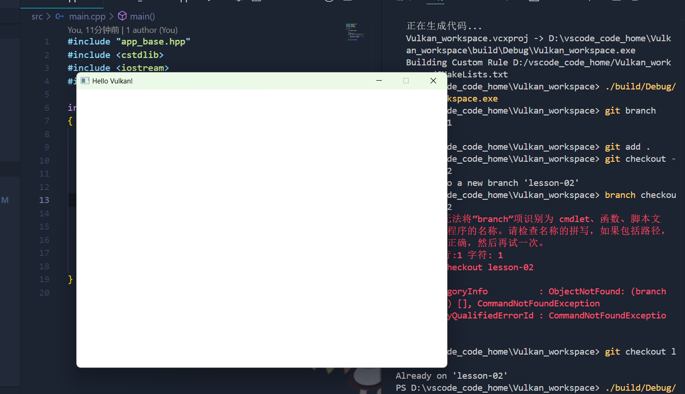

# Vulkan-02：学习第一个窗口程序。（GLFW库的实战）

学习写一个窗口程序，对cmake的理解进行加深，CmakeLists.txt如何进行更改，我们的.hpp， .cpp文件如何放置。

本节中我们将创建一个类，使用命名空间cre封装，这样我们后面的教程才有机会来绘制更多的内容。

项目肯定是要有一个主体的，项目中的很多内容都是新鲜的知识，比如说：
1. const 与 constexpr 的区别。
2. namespace 与 结构体，类的区别。
3. #pragma once的使用。
4. GLFW库的使用与尝试。

运行效果和上一章差别不大，但却是我们自己看得懂的代码，而不是GPT为我们代写的。

