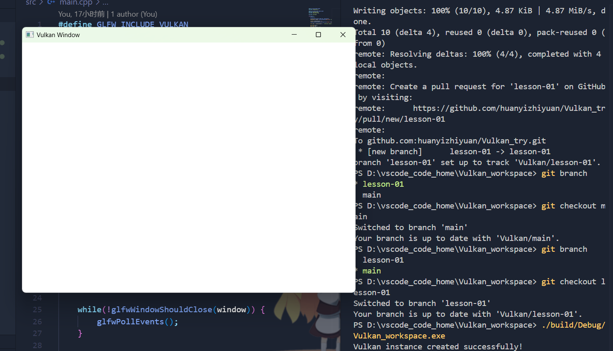

# Vulkan-01：配置环境，输出网站主要命令。

配置环境，主要是cmake，学会如何配置并使用vcpkg，使用好之后方便我们进行包管理。

环境配置好之后，可以用官网的代码测试一下，这就是简单的第一课。

命令：

1. 生成构建系统：`cmake -B build -S . -DCMAKE_TOOLCHAIN_FILE=D:/vcpkg/vcpkg/scripts/buildsystems/vcpkg.cmake`
2. 编译 `cmake --build build`
3. 运行 `./build/Debug/Vulkan_workspace.exe`

运行效果：
